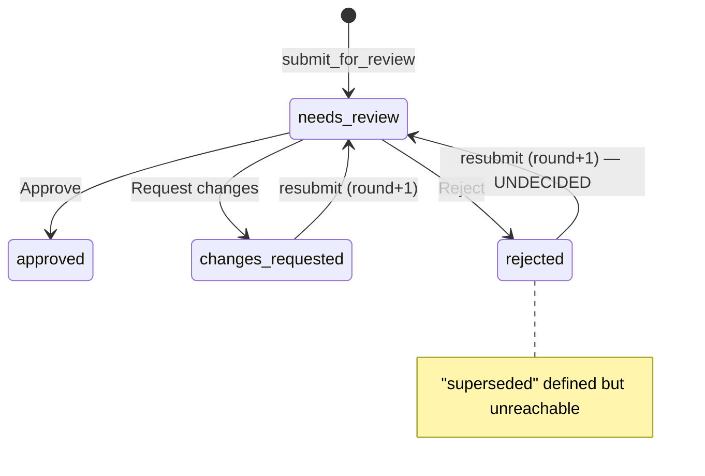

# Proposal: Rejected-proposal revival & the `superseded` state

**Task:** #10 — Define rejected-proposal revival + superseded semantics
**Status:** awaiting review

## Problem

Two loose ends in the review workflow's state machine:

1. **Silent revival.** `submitForReview` matches on `task_id + path` regardless
   of the document's current state. Resubmitting to a **rejected** proposal's
   path revives it as round N+1 — but the spec says "Reject → proposal dead."
   Nobody decided this.
2. **Dead vocabulary.** `DocumentState.superseded` exists in the enum and the
   DB vocabulary, but no code path ever sets it.

## Current state machine



## Options

### Option A — Bless revival (recommended)

Rejection means "this direction is dead *unless you fundamentally rework
it*." If Claude genuinely reworks the proposal and resubmits, reopening the
same document keeps the full round history — including the rejection and
the comments that caused it — attached to one artifact. The reviewer sees
*why* it was rejected last time, right in the "Earlier" panel.

- Change: **spec text only** — document that resubmission after rejection
  is a deliberate revival, visible as a new round.
- Give `superseded` its real transition: when a **different path** is
  submitted for the same task while an old proposal is `approved` or
  `rejected`, mark the old one `superseded`. One `UPDATE` inside
  `submitForReview`'s transaction:

```sql
UPDATE documents SET state = 'superseded', updated_at = ?
WHERE task_id = ? AND kind = 'proposal' AND path != ?
  AND state IN ('approved', 'rejected')
```

### Option B — Fresh row after rejection

`submitForReview` skips rejected rows when matching, always inserting a new
document (round 1) and marking the rejected one `superseded`. Cleaner
"dead means dead" semantics, but the rejection history detaches from the
live document — the reviewer loses the round-over-round context in the
panel, which is the feature's whole point.

### Option C — Hard block

Rejecting a proposal freezes its path; resubmission throws. Purest reading
of the spec, worst ergonomics — Claude must invent a new file name to try
again, and the board accumulates dead paths.

## Recommendation

**Option A.** It matches how the review loop is actually used (rejection is
feedback, not a tombstone), costs one spec paragraph plus one SQL statement,
and finally gives `superseded` a purpose instead of deleting it.

## Implementation sketch (if approved)

1. `Repository.submitForReview`: add the supersede `UPDATE` (transaction-safe,
   after the insert/revive branch).
2. Spec: add a "Rejection & revival" paragraph to §1 verdict semantics.
3. Tests: `testResubmitAfterRejectRevives`, `testNewPathSupersedesOldProposal`.
4. MCP: no tool changes — `get_task` already reports per-document `state`.
