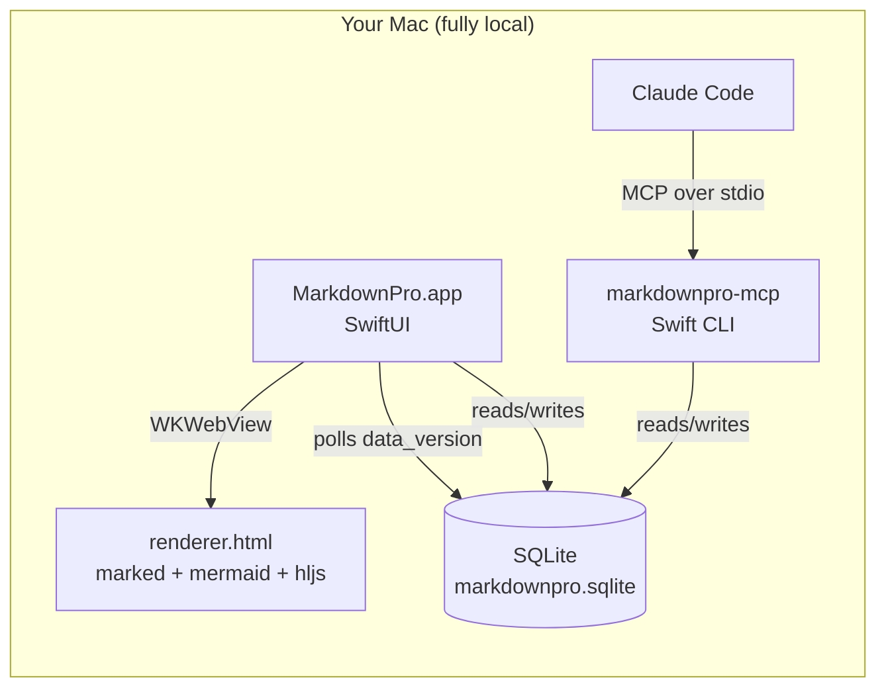
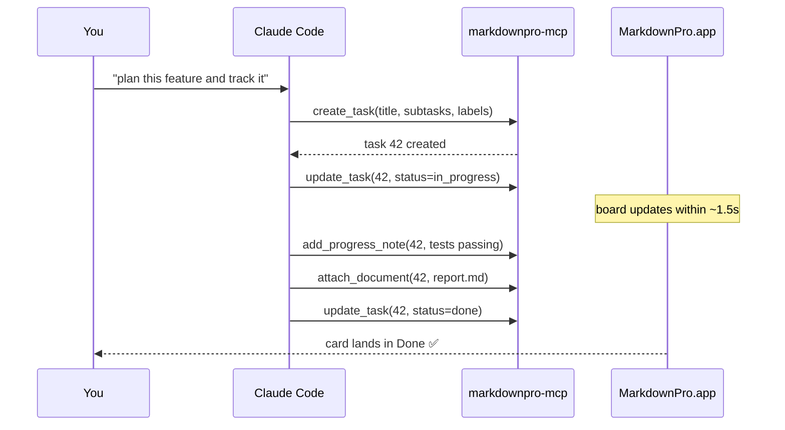

# MarkdownPro Architecture

This sample doc exercises everything the reader supports — it's also a
real description of how the app works. Open it in **Documents → Add
Folder → `docs/samples`**.

## System overview



## How a task flows



## Feature checklist

- [x] Kanban board with drag & drop
- [x] Labels, subtasks, due dates
- [x] Activity feed per task (you vs. Claude)
- [ ] iOS companion app (someday)

## Status values

| Status | Meaning | Board column |
| --- | --- | --- |
| `backlog` | Someday/maybe | Backlog |
| `todo` | Ready to pick up | Todo |
| `in_progress` | Being worked on | In Progress |
| `done` | Finished | Done |
| `canceled` | Won't do | Canceled |

## Example: creating a task from Swift

```swift
let repo = Repository(db: try Database.open())
let id = try repo.createTask(
    projectId: 1,
    title: "Ship the reader",
    priority: .high,
    labels: ["feature"],
    subtasks: ["Render mermaid", "Live reload"]
)
```

> **Tip:** point the reader at the folder where Claude writes its reports
> and they re-render live every time the file changes on disk.
