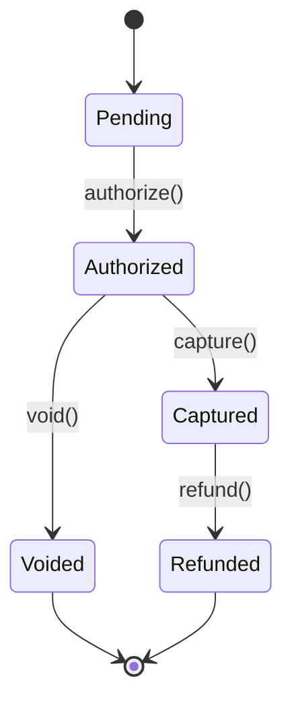

# Progress Report — Example

The kind of file Claude Code drops while working. Attach it to a task
with the `attach_document` MCP tool and it shows up in the task's detail
view with an **Open in Reader** button.

## Summary

Refactored the payments module. All 142 tests pass. Two follow-ups filed.

## What changed

| Area | Change | Risk |
| --- | --- | --- |
| `PaymentGateway` | Extracted retry logic into `RetryPolicy` | Low |
| `InvoiceStore` | Batched writes, 40% faster | Medium |
| `WebhookHandler` | Idempotency keys added | Low |

## State machine after the refactor



## Follow-ups

- [ ] Add jitter to `RetryPolicy` backoff
- [ ] Migrate legacy invoices to the new store
- [x] Update runbook

```python
# The idempotency check, for reference
def handle(event):
    if store.seen(event.idempotency_key):
        return Response.already_processed()
    store.record(event.idempotency_key)
    process(event)
```
